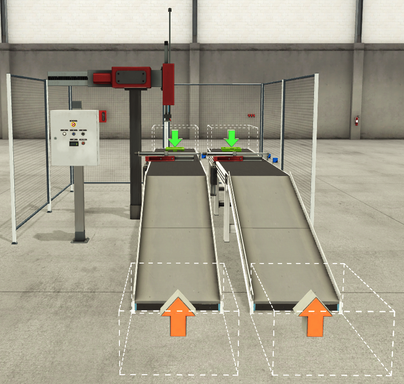
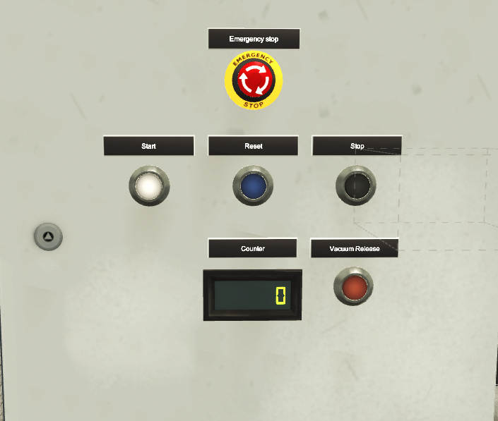
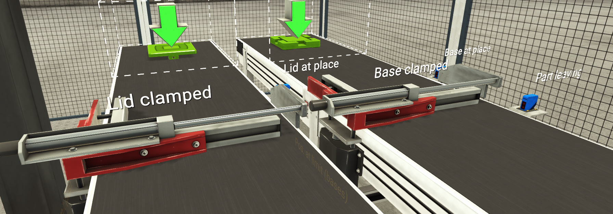
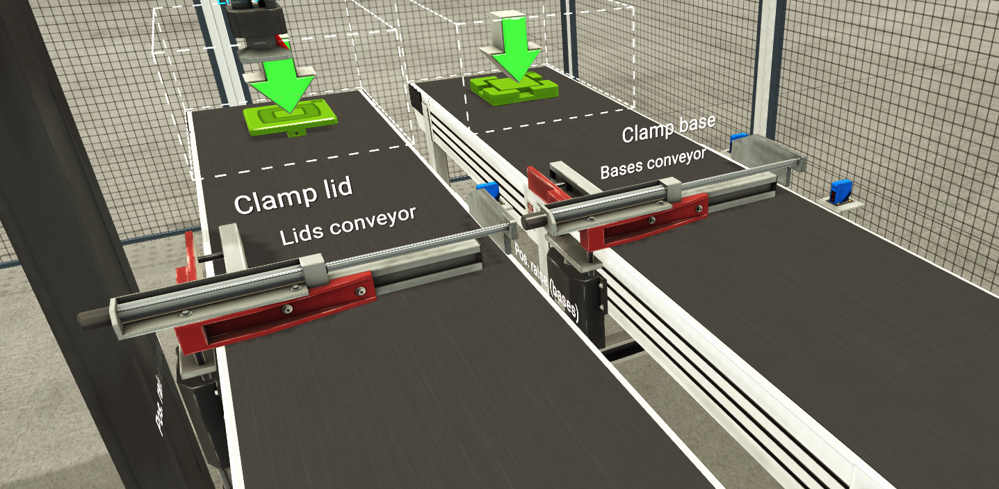
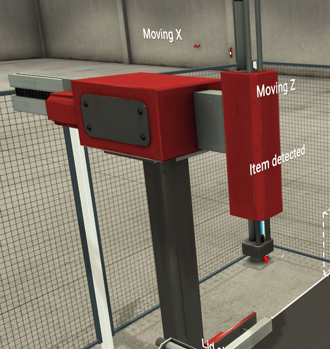
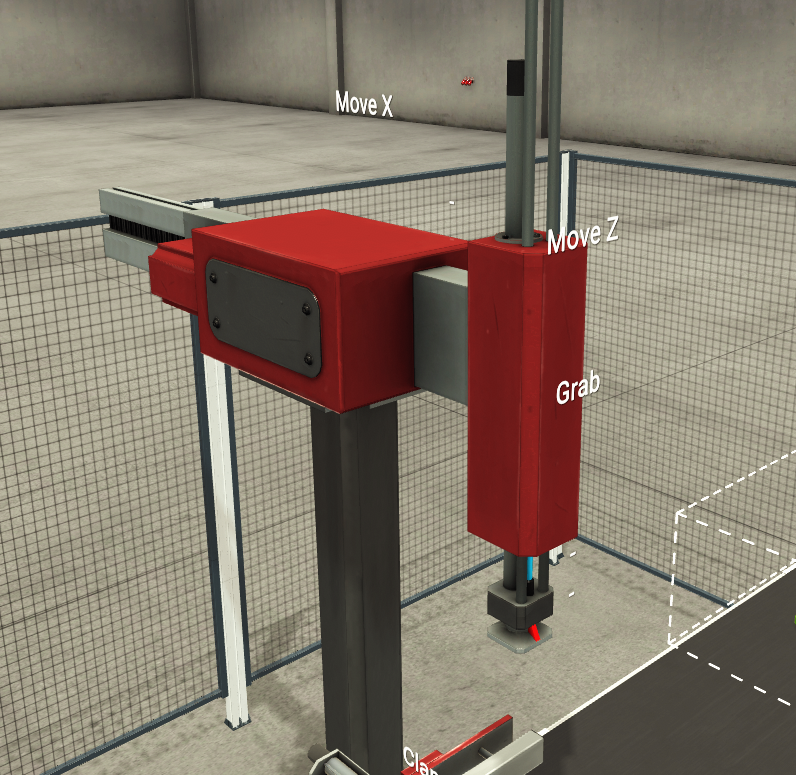

# Factory I/O Assembler – PLC Ladder Logic (CODESYS)

Simulasi lini perakitan otomatis di **Factory I/O** yang dikendalikan program **ladder logic CODESYS** (IEC 61131-3).

> **Objective:** Assemble parts made of lids and bases using a two-axis pick and place.

Sistem merakit produk yang terdiri dari lid dan base. Dua conveyor membawa lid dan base ke posisi masing-masing, lalu lengan pick-and-place 2 sumbu (X/Z) dengan gripper vakum memasang lid ke base. Produk jadi kemudian dihitung.

## Demo

[Tonton video demo](https://drive.google.com/file/d/1CyKIppeB3qQCbHB4MFrak4dVzG6ohpfF/view?usp=sharing)

## Scene Factory I/O

*Tampilan depan scene: dua conveyor (lid dan base), lengan pick-and-place, dan panel kontrol.*

### Panel Kontrol

*Panel operator: Emergency Stop, Start, Reset, Stop, Vacuum Release, dan tampilan counter produk.*

### Sensor dan Aktuator

| Sensor | Aktuator |
|---|---|
|  |  |
| Sensor conveyor: lid at place, lid clamped, base at place, base clamped, dan part leaving. | Aktuator conveyor: conveyor lid dan base, clamp lid, clamp base, dan pos. raise (bases). |
|  |  |
| Sensor lengan: moving X, moving Z, dan item detected. | Aktuator lengan: move X, move Z, dan grab. |

## Tools

| Item | Keterangan |
|---|---|
| Simulasi | Factory I/O (scene Assembler) |
| PLC / IDE | CODESYS (soft PLC) |
| Bahasa pemrograman | Ladder Diagram (LD) |
| Blok standar | TOF, CTU, RS, SR, F_TRIG |

## Fungsi Push Button

| Tombol | Fungsi |
|---|---|
| **Start** | Menjalankan sistem. |
| **Stop** | Menghentikan sistem tanpa mereset logika sekuensial yang tersimpan. Proses dapat dilanjutkan dengan menekan Start kembali. |
| **E-Stop** | Menghentikan sistem secara paksa. Selama E-Stop aktif, tombol Start, Stop, dan Reset tidak berfungsi. |
| **Vacuum Release** | Melepas vakum pada gripper, setara tombol pelepas *vacuum check valve* di sistem nyata. Hanya berfungsi ketika E-Stop sedang ditekan. |
| **Reset** | Mereset logika sekuensial yang tersimpan beserta counter. |

Ketentuan tombol Reset:
- Hanya dapat digunakan ketika sistem tidak berjalan dan gripper tidak sedang memegang lid.
- Urutan yang disarankan: tekan E-Stop, lepas (reset) E-Stop, baru tekan Reset.

**Kondisi E-Stop Saat Gripper Memegang Lid:**

Jika E-Stop ditekan ketika gripper sedang memegang lid, gripper tetap menahan lid agar tidak jatuh. Lid baru dilepas setelah tombol Vacuum Release ditekan.

Perilaku ini meniru *vacuum check valve* pada sistem pneumatik nyata, yang menjaga vakum tetap tertahan saat suplai berhenti sampai dilepas secara manual.

### Catatan Simulasi

Factory I/O tidak menyediakan komponen check valve. Karena itu, penahanan vakum diimplementasikan lewat logika PLC berupa latch internal `Holding_Item` (rung 10). Latch ini aktif selama `Grab` aktif dan `Sensor_item` mendeteksi benda, dan terlepas saat Vacuum Release (`Stop_Grab`) ditekan atau benda hilang dari sensor.

## Alur Proses (Operasi Normal)

1. **Start**: Tombol `Start` mengaktifkan dan mengunci (latch) `System_Running`. `Stop` dan `E_Stop` memakai kontak NC (TRUE saat kondisi normal), sehingga kabel putus otomatis menghentikan sistem (fail-safe).
2. **Conveyor berjalan**: Conveyor lid dan conveyor base berjalan selama sistem aktif.
3. **Berhenti di posisi ambil**: Saat lid atau base sampai di posisi ambil (`Sensor_Lid_atP`, `Sensor_Base_atP`), falling edge trigger mengaktifkan latch clamp, lalu conveyor yang bersangkutan berhenti melalui rangkaian seal-in.
4. **Mengambil lid**: Sumbu Z turun dan gripper (`Grab`) aktif saat `Sensor_item` mendeteksi lid (filter TOF 50 ms). Lid ditahan oleh latch `Holding_Item` yang meniru check valve, sampai tombol Vacuum Release (`Stop_Grab`, NC) ditekan atau lid tidak lagi terdeteksi sensor.
5. **Memindahkan lid**: Sumbu X menggerakkan lid ke atas base. `Arm_X_AtBase` menandakan lengan sudah berada di posisi base.
6. **Memasang lid**: Setelah sumbu Z selesai bergerak dan lengan berada di atas base, `Lid_Placed` aktif selama 500 ms (TOF dipakai sebagai pulse stretcher), lalu clamp base dilepas.
7. **Lengan kembali**: `Pos_Raise_B` dikunci (latch), kedua sumbu lengan kembali ke posisi awal (`Arm_Z_Returned`, `Arm_X_Return`), dan conveyor berjalan lagi.
8. **Menghitung produk**: Saat produk jadi keluar dari area (`Part_Leave`), falling edge menghasilkan `Part_Cleared` dan counter CTU bertambah.

## Struktur Program

| Rung | Fungsi |
|---|---|
| 1 | Urutan start / stop dengan seal-in |
| 2–4 | Lid conveyor: run, clamp latch, kondisi stop |
| 5–7 | Base conveyor: run, clamp latch, kondisi stop |
| 8 | Kontrol sumbu Z |
| 9–10 | Aktivasi gripper dan latch penahan vakum (`Holding_Item`) |
| 11–12 | Kontrol sumbu X dan konfirmasi posisi |
| 13 | Konfirmasi lid terpasang (pulsa 500 ms) |
| 14–16 | Base blockade latch, konfirmasi Z kembali, perintah X kembali |
| 17–18 | Deteksi part keluar dan counter produk jadi |

## Teknik yang Dipakai

- **Rangkaian stop fail-safe**: `E_Stop`, `Stop`, dan `Stop_Grab` (Vacuum Release) bertipe NC, sehingga kabel putus juga menghentikan fungsinya.
- **Emulasi vacuum check valve**: latch `Holding_Item` menahan benda saat E-Stop, menggantikan komponen yang tidak tersedia di Factory I/O.
- **Sequencing berbasis edge**: blok `F_TRIG` mengubah perubahan sinyal sensor menjadi event satu scan, sehingga urutan bergerak selangkah demi selangkah.
- **Latching dengan RS/SR**: kondisi sekuensial tetap tersimpan saat Stop ditekan dan hanya dihapus oleh Reset. Reset hanya diizinkan saat sistem berhenti dan gripper tidak memegang lid.
- **Filter timer**: TOF pada gripper dan konfirmasi lid terpasang untuk mencegah sinyal berkedip.
- **Rangkaian seal-in** untuk kondisi stop conveyor, dilepas oleh event kembalinya lengan.

## Komunikasi

Program CODESYS terhubung ke Factory I/O melalui **Modbus TCP**. CODESYS berperan sebagai slave (Slave ID 1) dan Factory I/O sebagai client yang terhubung ke `127.0.0.1:502`.

Arah data dilihat dari sisi PLC:
- **Coil** (Factory I/O ke PLC): sensor dan tombol, terbaca di CODESYS sebagai input (`%IX20.x`).
- **Discrete Input dan Input Register** (PLC ke Factory I/O): aktuator dan counter, ditulis dari output CODESYS (`%QX20.x`, `%QW`).

### Input PLC (Coil)

| Coil | Label di Factory I/O | Variabel |
|---|---|---|
| 0 | Moving X | `Moving_x` |
| 1 | Moving Z | `Moving_Z` |
| 2 | Item detected | `Sensor_item` |
| 3 | Lid at place | `Sensor_Lid_atP` |
| 4 | Lid clamped | `Lim_Lid` |
| 6 | Base at place | `Sensor_Base_atP` |
| 9 | Part leaving | `Part_Leave` |
| 10 | Start | `Start` |
| 11 | Reset | `Reset` |
| 12 | Stop | `Stop` (NC) |
| 13 | Emergency stop | `E_Stop` (NC) |
| 14 | Vacuum Release | `Stop_Grab` (NC) |

### Output PLC (Discrete Input dan Input Register)

| Alamat | Label di Factory I/O | Variabel |
|---|---|---|
| Input 0 | Move X | `Move_x` |
| Input 1 | Move Z | `Move_Z` |
| Input 2 | Grab | `Grab` |
| Input 3 | Lids conveyor | `lid_conv` |
| Input 4 | Clamp lid | `Clamp_Lid` |
| Input 6 | Bases conveyor | `base_conv` |
| Input 7 | Clamp base | `Clamp_Base` |
| Input 8 | Pos. raise (bases) | `Pos_Raise_B` |
| Input Reg 0 | Counter | `CV1` |

## Penulis

**Izzuddin Alqassam**, Teknik Elektro, Universitas Hasanuddin
Fokus: sistem kontrol, PLC, otomasi industri
