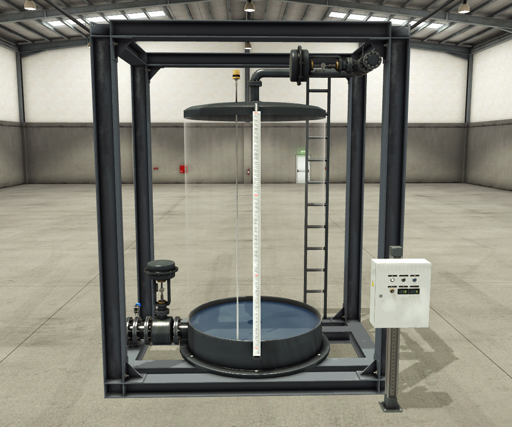
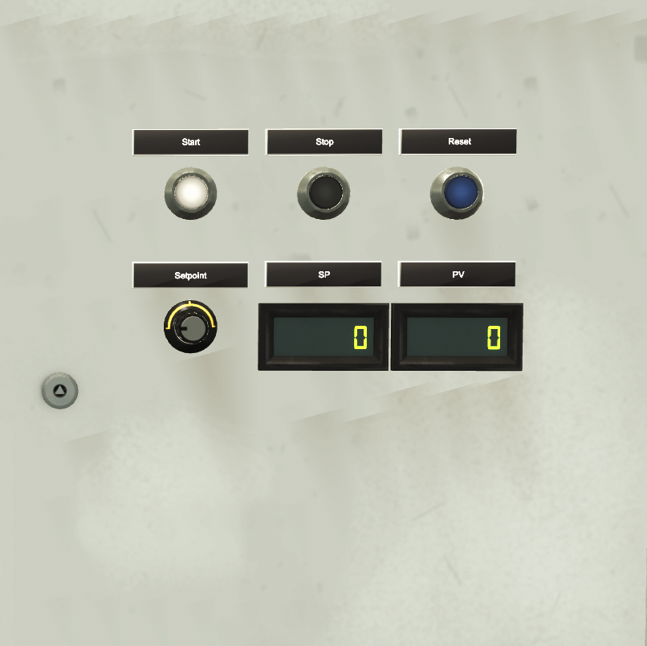
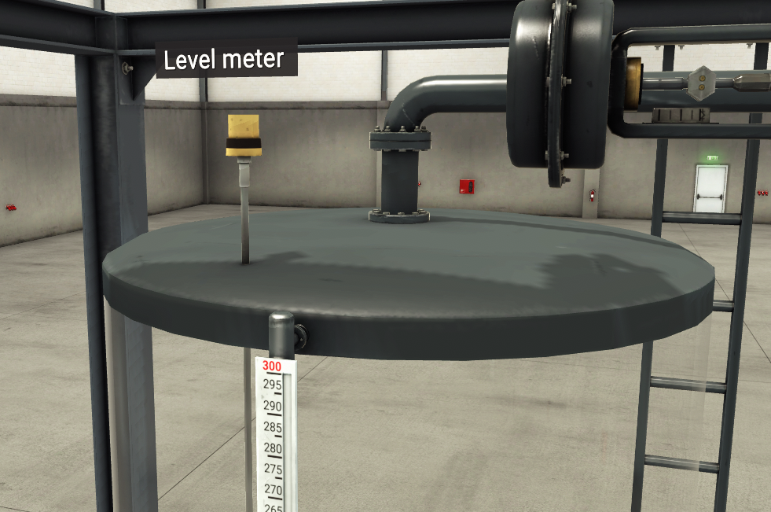
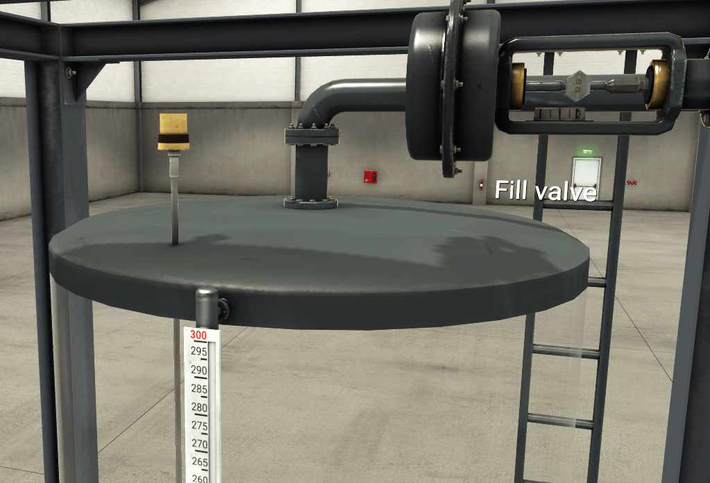
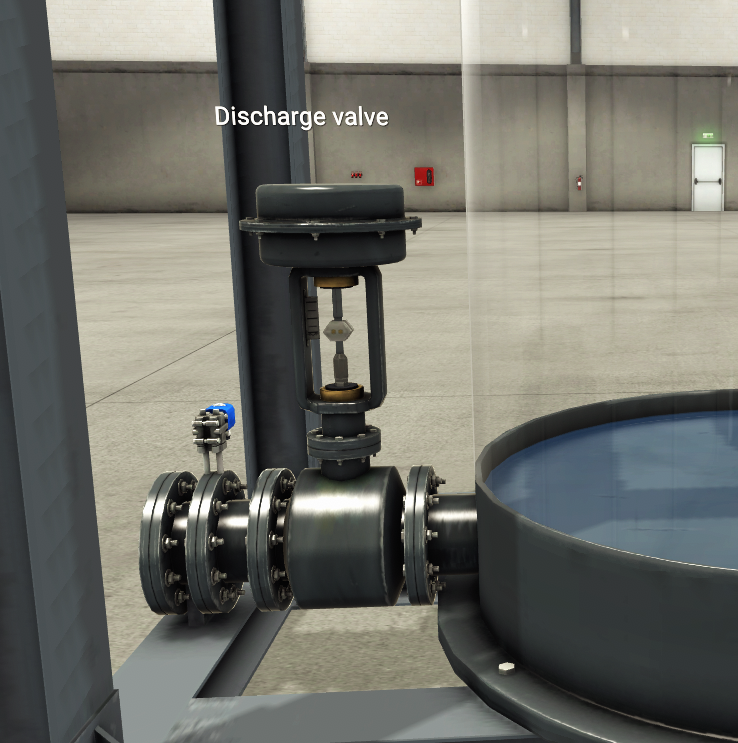

# Factory I/O Fill Tank PID – PLC Ladder Logic (CODESYS)

Simulasi tank filling di **Factory I/O** (scene Level Meter) yang dikendalikan program **ladder logic CODESYS** (IEC 61131-3) dengan **PID level control**.

> **Objective:** Fill a tank to a setpoint set by a potentiometer using PID level control, and discharge it on demand.

Sistem mengisi tangki sampai level yang ditentukan lewat potentiometer. Fill rate diatur otomatis oleh PID controller berdasarkan pembacaan level meter, sehingga level mendekati setpoint dengan halus tanpa overshoot. Tangki dapat dikosongkan lewat tombol Reset.

## Demo

[Tonton video demo]((https://drive.google.com/file/d/1uPpK1wRxSMH1t41eR7hDkerCoe2OVkoA/view?usp=sharing))

## Factory I/O Scene

*Tampilan depan scene: tangki dengan level meter, Fill valve, dan Discharge valve.*

### Control Panel

*Panel operator: Start, Stop, Reset, potentiometer setpoint, dan indicator lamp.*

### Sensor dan Actuator

| Sensor | Actuator (Fill) | Actuator (Discharge) |
|---|---|---|
|  |  |  |
| Level meter: mengukur level air di tangki (analog, 0–300 cm). | Fill valve: mengatur laju pengisian (analog). | Discharge valve: mengatur laju pengosongan (analog). |

## Tools

| Item | Keterangan |
|---|---|
| Simulasi | Factory I/O (scene Level Meter) |
| PLC / IDE | CODESYS (soft PLC) |
| Bahasa pemrograman | Ladder Diagram (LD) |
| Blok standar | PID, TOF, GT, LE, MOVE, REAL_TO_WORD, WORD_TO_REAL |

## Push Button Functions

| Tombol | Fungsi |
|---|---|
| **Start** | Memulai proses fill. `Fill_Valve` di-latch aktif (seal-in) dan PID mengatur fill rate menuju setpoint. |
| **Stop** | Menghentikan proses fill. Memakai kontak NC (TRUE saat kondisi normal), sehingga kabel putus otomatis menghentikan fill (fail-safe). |
| **Reset** | Membuka Discharge valve untuk mengosongkan tangki ke kondisi awal. |
| **Potentiometer** | Mengatur setpoint level. |

## Process Flow (Normal Operation)

1. **Start**: Tombol `Start` mengaktifkan dan me-latch `Fill_Valve`. `Stop` memakai kontak NC sehingga memutus seal-in saat ditekan.
2. **Level dan setpoint reading**: `Level_Meter` dan `Setpoint` (WORD) dikonversi ke REAL (`R_Level_Meter`, `R_Setpoint`) agar bisa diproses blok PID (lihat bagian [Data Type Conversion](#data-type-conversion)). Level sudah dalam satuan 0–300 cm hasil scaling di driver Factory I/O.
3. **PID control**: PID membandingkan level aktual dengan setpoint dan menghasilkan `Fill_Rate` dalam rentang 0–300 (dibatasi `Y_MIN`/`Y_MAX`). Hasilnya dikonversi ke WORD (`WFill_Rate`) dan dikirim ke Fill valve di Factory I/O.
4. **Discharge**: Tombol `Reset` mengaktifkan dan me-latch `Disc_Valve`. Saat `Disc_Valve` aktif, `Disc_Rate` diisi 300 (valve terbuka penuh), selain itu 0.
5. **Tank empty**: Saat `Disc_Valve` aktif dan level ≤ 0,5 cm, `Disc_Stop` aktif dan melepas seal-in. Timer TOF menahan Discharge valve tetap terbuka 5 detik lagi agar sisa air benar-benar habis, lalu valve menutup.
6. **Indicator dan alarm**: `Led_Stop` menyala saat tidak ada proses fill maupun discharge dan tangki belum kosong (level > 0,5 cm). `High_Level_Alarm` aktif saat level melebihi 295 cm.

## Program Structure

| Rung | Fungsi |
|---|---|
| 1 | Fill Run: Start/Stop seal-in |
| 2 | Discharge Run: seal-in dengan 5 s off-delay |
| 3 | Fill Rate output conversion (REAL → WORD) |
| 4 | Level input scaling (WORD → REAL) |
| 5 | Setpoint input conversion (WORD → REAL) |
| 6–7 | Discharge Rate: Open (300) dan Closed (0) |
| 8 | Tank Empty detection |
| 9 | Fill Level PID control |
| 10 | Stop Indicator Lamp |
| 11 | High Level Alarm |

## Techniques Used

- **PID level control**: blok `PID` bawaan CODESYS dengan output dibatasi 0–300 sesuai rentang valve.
- **Fail-safe stop circuit**: tombol `Stop` bertipe NC, sehingga kabel putus juga menghentikan fill.
- **Seal-in circuit** untuk Fill dan Discharge.
- **Off-delay (TOF)**: Discharge valve tetap terbuka 5 detik setelah level mencapai batas kosong.
- **Data type conversion**: WORD ↔ REAL agar blok `PID` (REAL) kompatibel dengan register Modbus (WORD).
- **Alarm dan indicator** berbasis comparator `GT` dan `LE`.

## PID Parameters

| Parameter | Nilai |
|---|---|
| Kp | 10 |
| Tn | 13 |
| Tv | 0 (PI controller) |
| Y_MIN / Y_MAX | 0 / 300 |
| Y_MANUAL | 150 |

Parameter di-tuning manual (trial and error) sampai respons mencapai setpoint tanpa overshoot.

## Communication

Program CODESYS terhubung ke Factory I/O melalui **Modbus TCP**. CODESYS berperan sebagai slave dan Factory I/O sebagai client.

### Data Type Conversion

Blok `PID` di CODESYS bekerja dengan tipe **REAL** (input `ACTUAL`, `SET_POINT`, dan output `Y`). Sementara itu, mapping Modbus ke Factory I/O lewat **Input Register** dan **Holding Register** memakai array bertipe **WORD** (16-bit per register). Karena tipenya berbeda, diperlukan konversi di kedua sisi:

| Arah | Konversi | Rung |
|---|---|---|
| Input: Level Meter | `Level_Meter` (WORD) → `R_Level_Meter` (REAL) | 4 |
| Input: Setpoint | `Setpoint` (WORD) → `R_Setpoint` (REAL) | 5 |
| Output: Fill rate | `Fill_Rate` (REAL) → `WFill_Rate` (WORD) | 3 |

Alurnya: **WORD (dari Factory I/O) → REAL → PID → REAL → WORD (ke Factory I/O)**.

### PLC Inputs

| Label di Factory I/O | Variabel | Keterangan |
|---|---|---|
| Start | `Start` | Push button |
| Stop | `Stop` | Push button (NC) |
| Reset | `Reset` | Push button |
| Level Meter | `Level_Meter` | Analog, 0–300 cm |
| Setpoint (potentiometer) | `Setpoint` | Analog |

### PLC Outputs

| Label di Factory I/O | Variabel | Keterangan |
|---|---|---|
| Fill | `WFill_Rate` | Fill rate (analog) |
| Discharge | `Disc_Rate` | Discharge rate (analog) |
| Stop lamp | `Led_Stop` | Indicator |

## Future Improvements

- Interlock agar Fill dan Discharge tidak aktif bersamaan.
- `High_Level_Alarm` ikut menghentikan Fill.
- Integrasi dengan TIA Portal dan penambahan HMI/SCADA.

## Author

**Izzuddin Alqassam**, Teknik Elektro, Universitas Hasanuddin
Fokus: sistem kontrol, PLC, otomasi industri
